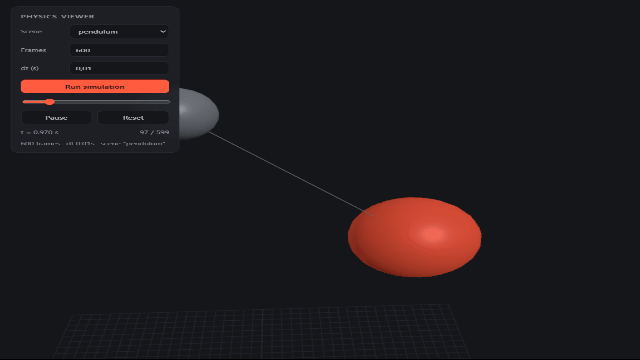
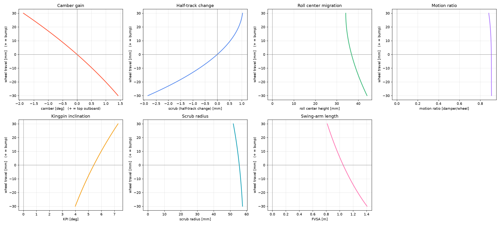

# Reference Engine

A lightweight Python library for building and simulating mechanical systems using
**reference frames**, rigid bodies, and constraints. Designed as an educational and
experimental tool for studying dynamics, with an emphasis on physical concepts:
reference frames, transformations, and equations of motion.

<p align="center">
  
  <br>
  <em>A constrained pendulum — gravity plus a distance constraint — rendered in the browser via <a href="https://github.com/renan-dutra-fsae/physics_viewer">physics_viewer</a>.</em>
</p>

> **Status:** under active development. The API may change.

## The ecosystem

Reference Engine is the simulation core of a small toolchain:

| Repo | Role |
|------|------|
| **reference-engine** (this repo) | Physics core — frames, bodies, forces, constraints, integration |
| [simulation_server](https://github.com/renan-dutra-fsae/simulation_server) | Thin FastAPI layer that runs a scene and streams trajectories as JSON |
| [physics_viewer](https://github.com/renan-dutra-fsae/physics_viewer) | three.js GUI that plays the trajectories back in the browser |

The engine runs headless; the server and viewer are optional and only needed for
interactive 3D visualization. The end goal is to apply the engine to **vehicle
dynamics** (FSAE suspension kinematics).

## Features

- Hierarchical reference frames (`Frame` with parent/child relationships)
- 3D geometry primitives: `Point`, `Vector`, `Line`, `Plane`
- Particle dynamics with a Verlet-style integrator
- Forces (e.g. `Gravity`) applied per body
- Position constraints solved with a Gauss–Seidel / PBD loop (rods, links, springs)
- A `World` that ties bodies, forces, and constraints together and steps them in time

## Installation

Requires Python 3.9+.

```bash
git clone https://github.com/renan-dutra-fsae/reference-engine.git
cd reference-engine
pip install -e .
```

This installs the `reference_engine` package (NumPy, SciPy, Matplotlib).

## Quick start

A particle falling under gravity:

```python
import numpy as np
from reference_engine.world import World
from reference_engine.geometry import Point, Vector
from reference_engine.force import Gravity

world = World(world_origin=np.zeros(3))
ball = world.add_particle("ball", mass=1.0,
                          position=Point(0.0, 0.0, 100.0),
                          velocity=Vector(0.0, 0.0, 0.0))

gravity = Gravity("gravity", Vector(0.0, 0.0, -9.81))
gravity.set(ball)
world.add_force(gravity)

for _ in range(200):
    world.step(0.01)
    print(ball.get_position())   # z decreases as it falls
```

Note that **z is the vertical axis** (gravity points along −z).

## Examples

Runnable scripts live in [`examples/`](examples/) and animate with Matplotlib:

```bash
python examples/01_free_fall.py
python examples/03_pendulum.py
```

<p align="center">
  
  <br>
  <em>Free fall under gravity.</em>
</p>

## Core concepts

- **Geometry** (`geometry.py`) — `Point` and `Vector` in 3D, with the usual algebra
  (dot, cross, norm), plus `Line` and `Plane` with intersection/distance helpers.
- **Frame** (`frame.py`) — a reference frame defined by an origin and rotation, with a
  parent and children, for hierarchical coordinate systems.
- **Body** (`body.py`) — `Particle` (point mass) and `RigidBody`. Forces accumulate into
  a resultant each step.
- **Force** (`force.py`) — a named vector applied to a set of bodies; `Gravity` is built in.
- **Constraint** (`constraints.py`) — `PositionConstraint` keeps two particles a fixed
  distance apart (rods, control arms), solved iteratively after forces, before integration.
- **Integrator** (`integrator.py`) — advances each body one timestep (Verlet-style).
- **World** (`world.py`) — the simulation hub: `add_particle`, `add_force`,
  `add_position_constraint`, and `step(dt)`.

## Roadmap

- [ ] Higher-order integration (RK4) selectable per simulation
- [ ] Full rigid-body dynamics (orientation + angular velocity)
- [ ] Additional force and constraint types (springs, dampers, hinges)
- [ ] Multibody systems and chained constraints
- [ ] Vehicle dynamics: double-wishbone kinematics, camber gain, bump steer

<p align="center">
  
  <br>
  <em>2d kinematics.</em>
</p>

## Current limitations

This is a work in progress, and a couple of things are intentionally honest about it:

- **`RigidBody` is a stub** — only `Particle` dynamics are fully wired up. Suspension
  hardpoints are modeled as particles for now.
- **The integrator is first-order** (explicit Verlet). Fine for kinematic / quasi-static
  problems; RK4 is on the roadmap for stiff dynamics (springs, dampers).

## License

[MIT](LICENSE)